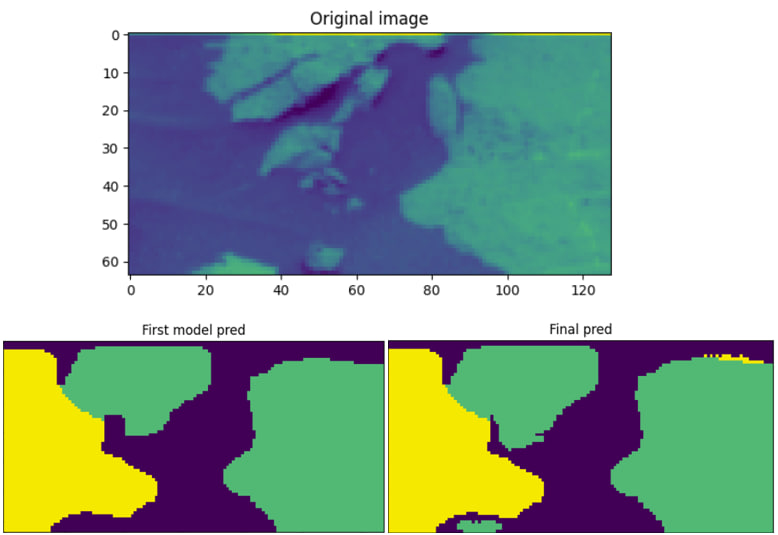

# Two-Stage Semantic Segmentation of Martian Surfaces

This repository contains the code, report, and additional materials for a two-stage semantic segmentation approach applied to Martian surface images. The goal is to segment each pixel of a given grayscale image into one of five classes: Background, Soil, Bedrock, Sand, or Big Rock. Our pipeline uses a first model to produce initial coarse predictions and a second model to refine these predictions, thereby improving overall segmentation accuracy and handling class imbalance more effectively.

## Contents

- **Preprocessing Notebook** (`ai-hw2-preprocessing.ipynb`):  
  Handles initial data cleaning and preparation.  
  Key steps include:
  - Outlier detection and removal (via template matching, autoencoders, PCA, and k-NN).
  - Class distribution analysis.
  - Augmentation of minority classes, particularly Big Rock patches.
  - Saving the cleaned and augmented dataset for subsequent training.

- **First Model Notebook** (`ai-hw2-first-model.ipynb`):  
  Implements the initial U-Net based model with gated skip connections and deep supervision.  
  Highlights include:
  - Use of focal loss to combat class imbalance.
  - Training with a stratified split, data augmentation, and early stopping.
  - Morphological post-processing of predictions to reduce noise.

- **Second Model Notebook** (`ai-hw2-second-model.ipynb`):  
  Refines predictions from the first model by using them as additional input channels.  
  Key points:
  - Takes original images and first-model predictions as input.
  - Uses a similar U-Net architecture with gated connections.
  - Improves Mean IoU and better segments minority classes.

- **Report** (`report.pdf`):  
  A comprehensive three-page report detailing:
  - The problem definition and challenges.
  - Methodology, including architectural choices and two-stage design.
  - Experimental results, tables, and figures.
  - Critical discussion and future directions.

- **References** (`references.bib`):  
  A set of references used in the report, including foundational papers on deep learning, segmentation architectures, and refinement strategies.

## Getting Started

1. **Data Setup**:  
   Place the provided dataset files in the appropriate paths as indicated in the notebooks. Make sure `mars_for_students.npz` and `cleaned_training_set.npz` are accessible.

2. **Dependencies**:  
   - Python 3.x  
   - TensorFlow/Keras  
   - Albumentations  
   - Segmentation Models (Keras/TensorFlow)  
   - scikit-learn, numpy, matplotlib, seaborn  
   
   See each notebook for specific imports and potential `pip install` commands.

3. **Running the Code**:  
   - Run `preprocessing.ipynb` to prepare the dataset.  
   - Run `first_model.ipynb` to train and evaluate the initial segmentation model.  
   - Run `second_model.ipynb` to generate refined predictions and achieve improved segmentation performance.

## Results

- The first model provides a baseline segmentation but struggles with rare classes.
- The second model, leveraging the first model’s predictions, improves Mean IoU and class-specific performance.
- Morphological post-processing and careful preprocessing steps further enhance prediction quality.

## Future Work

Possible future directions include:
- Experimenting with transformer-based backbones for better global context.
- Integrating uncertainty estimation and active learning strategies.
- Automating augmentation pipelines to better handle diverse planetary terrains.
